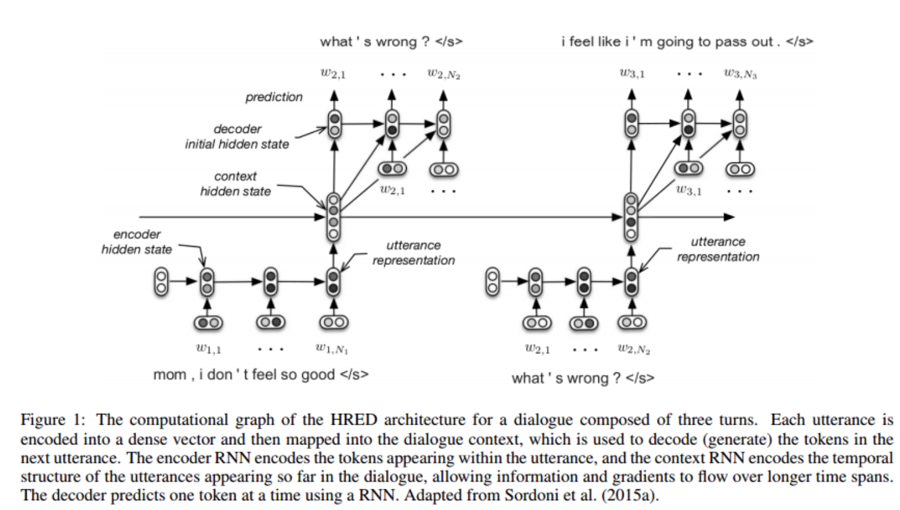

# tf_hierarchical_encoder_decoder

## Description
본 논문에서의 핵심 아이디어는 하나의 문자에서의 순서를 고려하는것 뿐만 아니라 문장끼리의 순서도 고려한 것이다. 

### query level
쿼리 level을 우리가 일반적으로 수행하던 단어의 sequence를 넣으면 인코딩후 decoder를 통해 단어의 sequence를 생성한다.
 
 
### Session level
위의 그림을 보면 query level의 encoding의 결과들을 RNN에 넣음으로써 Session의 전체 흐름을 고려할 수 있게 된다.(문장의 encoding vector를 encoding한다.)

## Requirements

- Python 3.6
- TensorFlow 1.4

## Reference

- [A Hierarchical Recurrent Encoder-Decoder For Generative Context-Aware Query Suggestion](https://arxiv.org/abs/1507.02221)

## Author
junbeomlee
